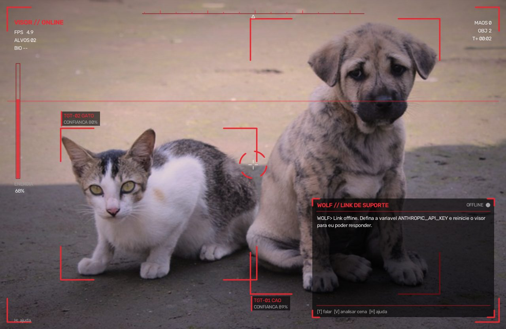

# CameraQueDetecta

Dois programas que usam a webcam, OpenCV e MediaPipe:

| Programa | O que faz |
|----------|-----------|
| `main.py` (MemeCV) | Reconhece expressões e gestos (sorriso, joinha, paz, pensando, timeout) e mostra o meme correspondente. |
| `visor.py` (Visor + Wolf) | Protótipo da interface de um visor de ciborgue: HUD vermelho/branco com miras em rostos, mãos e objetos, e o **Wolf**, uma IA de suporte que conversa com você pelo canto da lente. |



## Instalação (Windows / PowerShell)

```powershell
pip install -r requirements.txt
```

Na primeira execução os modelos do MediaPipe são baixados para `models/`
(rosto ~3,7 MB, mãos ~7,8 MB, objetos ~4,6 MB).

## Visor + Wolf

O Wolf usa por padrão o [Ollama](https://ollama.com), que roda um modelo de IA de graça
no seu próprio PC. Na primeira vez:

1. Instale o Ollama para Windows em https://ollama.com/download e deixe o aplicativo aberto.
2. Baixe o cérebro do Wolf (~3,3 GB, uma vez só; se a internet cair, rode de novo que ele continua):

   ```powershell
   ollama pull gemma3:4b
   ```

3. Rode o visor:

   ```powershell
   python visor.py
   ```

Se o Ollama não estiver aberto, o visor funciona normalmente e o Wolf avisa no painel.
A primeira resposta demora alguns segundos enquanto o modelo carrega.

Outros cérebros (opcional):

```powershell
$env:WOLF_MODEL = "gemma3:1b"          # mais leve (~0,8 GB), mas sem a tecla V (não enxerga imagens)
$env:ANTHROPIC_API_KEY = "sua-chave"   # usa o Claude (pago, mais esperto) no lugar do Ollama
$env:WOLF_BACKEND = "ollama"           # força o Ollama mesmo com a chave definida
```

| Tecla | Ação |
|-------|------|
| `T` ou `ENTER` | abre o canal com o Wolf; digite e aperte `ENTER` para enviar |
| `V` | envia a imagem atual da câmera para o Wolf analisar |
| `M` | liga/desliga a voz do Wolf |
| `1` / `2` / `3` | liga/desliga os detectores de rosto, mãos e objetos |
| `L` | liga/desliga o efeito da lente |
| `H` | mostra/esconde a ajuda |
| `ESC` | sai (ou cancela a digitação) |

### Mais FPS

A câmera e os detectores rodam em paralelo: o vídeo continua fluido mesmo quando a detecção
é mais lenta, e as miras usam o último resultado pronto. No canto superior esquerdo,
`FPS` é a fluidez da janela e `SENSORES` é quantas vezes por segundo a detecção roda.
Se ainda estiver lento:

| O que fazer | Ganho |
|-------------|-------|
| Tecla `3` (ou `--no-objects`): desliga o detector de objetos | o maior ganho na detecção |
| Teclas `1` e `2`: desligam rosto ou mãos | médio |
| Tecla `L` (ou `--no-lens`): desliga o efeito vermelho da lente | pequeno |
| `--object-every 6`: objetos só a cada 6 quadros (padrão 3) | médio |
| `--width 960`: janela menor | pequeno |
| Feche o Ollama quando não estiver falando com o Wolf | ajuda em PCs sem placa de vídeo |

A janela do OpenCV não aceita acentos; para escrever com acentos, digite a mensagem
no próprio terminal do PowerShell e aperte `ENTER`.

Quando a pergunta é sobre a cena ("o que você vê?", "o que tem na minha mão?",
"quantas pessoas tem aqui?") ou quando você aperta `V`, o Wolf recebe junto o que os
sensores detectam. Nas outras mensagens ele só conversa, sem relatar os sensores.

### Voz do Wolf

O Wolf fala as respostas em voz alta com um efeito robótico (mais grave, metálico, com
filtro de rádio). Não precisa instalar nada: no Windows ele usa a voz do próprio sistema.
Se a voz sair com sotaque em inglês, instale a voz em português em
*Configurações > Hora e idioma > Fala > Adicionar vozes > Português (Brasil)*.

```powershell
python visor.py --no-voice           # começa sem voz (a tecla M liga/desliga)
$env:WOLF_VOICE_NAME = "Daniel"      # escolhe outra voz instalada pelo nome
```

Os ajustes do efeito (grave, metálico, eco, filtro) ficam no topo de `voice.py`.

Opções úteis:

```powershell
python visor.py --camera 1                 # outra webcam
python visor.py --image foto.jpg           # usa uma foto no lugar da webcam
python visor.py --image foto.jpg --snapshot saida.png   # salva o HUD e sai
```

Arquivos:

- `visor.py`: laço principal, sensores (rosto e mãos do MemeCV + detector de objetos) e teclado.
- `visor_hud.py`: desenho do HUD (lente, moldura, miras, leituras, painel do Wolf).
- `wolf.py`: personalidade do Wolf e conversa pelo Ollama (padrão) ou pela API do Claude.
- `voice.py`: voz robótica do Wolf (síntese do sistema + efeitos em numpy).

## MemeCV

```powershell
python main.py
```

Coloque as imagens dos memes em `assets/new/` (veja `assets/new/README.md`).
